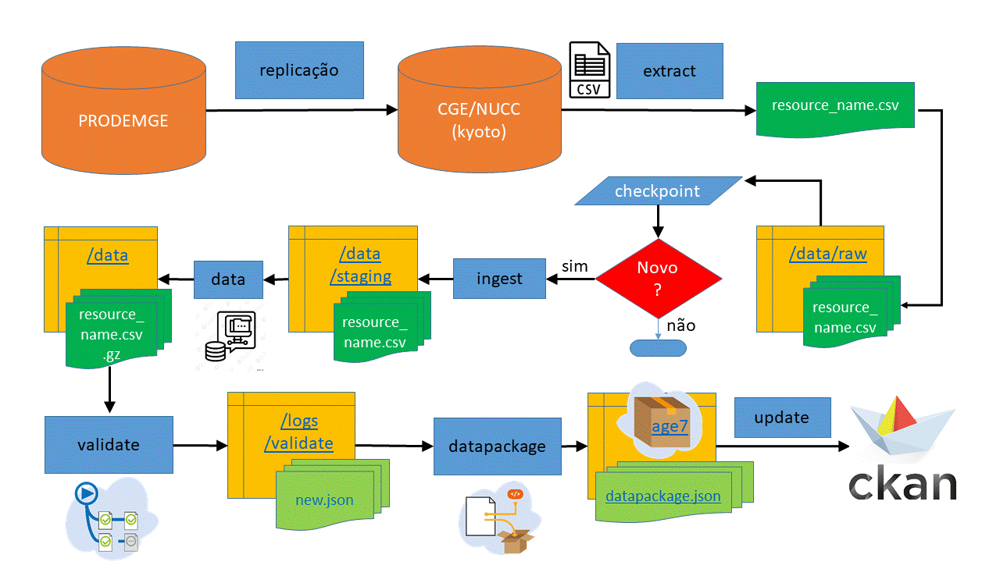

# Fluxo resumido de ETL do repositório age7

---
Replicação --> extract --> ingest --> data --> validate --> datapackage
---

1. replicação do banco do PdT: PRODEMGE para CGE, via servidor Kyoto do NUCC 

2. extract: inclui arquivos novos, não replica os já existentes (e também não verifica se existem linhas novas nos arquivos)

3. ingest: analisa _checksum_ dos aquivos da pasta `data-raw` para processar somente arquivos que tiveram mudança e os salva em `/data/staging`;

4. data: comprime arquivos que mudaram e salva na pasta `\data`

5. validate: realiza operação de validação e inclui rol dos metadados de validação em `/logs/validate`

6. datapackage: atuliza o `datapackage.json` na raiz do repositório com as novas infos 
